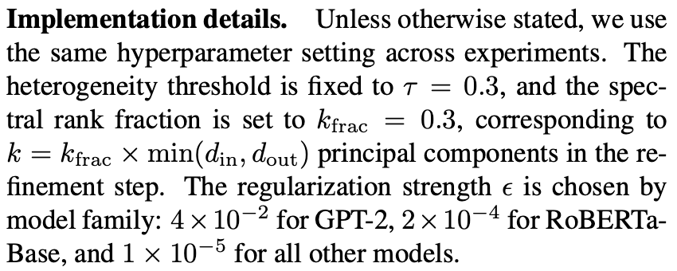

# ACE-Merging

<p align="center">
  <a href="./README.zh-CN.md">中文</a> |
  <a href="./README.md">English</a>
</p>

CVPR 2026 论文官方实现：

**ACE-Merging: Data-Free Model Merging with Adaptive Covariance Estimation**

ACE-Merging 是一种 **data-free model merging** 方法，可以在不使用原始训练数据的情况下，将多个针对不同任务 fine-tune 得到的专家模型合并成一个静态的多任务模型

---

## 最新信息

- 本仓库提供 ACE-Merging 在 GPT-2、ViT 和 RoBERTa 相关实验中的实现与复现流程
- ACE-Merging 面向 data-free model merging 场景：只需要 base model 和 fine-tuned checkpoints，不需要原始训练数据

---

## 方法概览

模型合并的目标是将多个任务专家模型合并为一个统一模型，同时尽可能保留各个专家模型的能力。与 RegMean 类方法一致，ACE-Merging 的出发点也是：希望最小化合并后模型与每个单独专家模型之间的预测差异

RegMean 通过任务数据的输入协方差来指导模型合并，因此仍然依赖输入数据。但在真实场景中，原始 fine-tuning 数据往往因为隐私、存储或部署限制而不可用

ACE-Merging 的核心观察是：

> SFT 结束后，模型参数的变化并不是简单的权重偏移，它可能隐式包含了任务数据分布的信息

给定 base model $(W_0)$ 和 fine-tuned expert $(W_t)$，ACE-Merging 首先计算 task vector：

```text
ΔW_t = W_t - W_0
```

传统 RegMean 需要使用输入样本估计协方差，而 ACE-Merging 直接从 fine-tuning update 本身估计任务相关的协方差代理：

```text
Σ_t ≈ ΔW_t^T ΔW_t
```

因此，ACE-Merging 保留了 RegMean “基于协方差的闭式合并”思想，但移除了对任务数据的依赖

---

## 方法特点

- **Data-free**：不需要访问任何训练数据
- **闭式合并**：不需要额外 fine-tuning，也不需要梯度优化
- **协方差感知**：利用 task vector 估计任务相关的二阶结构
- **自适应归一化**：自动处理不同任务 update magnitude 的差异
- **谱修正**：在任务异质性较强时提升合并稳定性
- **支持多类模型**：代码支持 GPT-2、RoBERTa、ViT 和 LLaMA 风格的 checkpoints

---

## 方法组成

ACE-Merging 主要包含三个部分：

1. **自适应协方差估计**
   从 fine-tuning update 中估计任务相关的协方差结构

2. **自适应协方差归一化**
   当不同任务的参数更新尺度差异较大时，对协方差估计进行归一化，降低任务间干扰

3. **谱修正**
   当初步合并结果的奇异值分布过于集中时，引入低秩修正，提高合并结果的稳定性

整个流程不需要训练数据，不需要梯度计算，最终得到一个静态 merged model

---

## 仓库结构

```text
ACE-Merging/
├── main.py                         # 主入口
├── draw.py                         # 可视化工具
├── control/
│   ├── config.py                   # 配置文件管理
│   └── pipeline.py                 # Pipeline 控制器
├── src/
│   ├── merge/
│   │   ├── strategy.py             # 合并策略，包括 ACE
│   │   └── sparsify.py             # 稀疏化工具
│   ├── models/
│   │   ├── modeling.py             # ViT 封装
│   │   └── heads.py                # 分类头
│   ├── datasets/                   # 数据集加载
│   └── steps/
│       ├── step0.py                # 检查或加载 task vectors
│       ├── step1.py                # 计算 task vectors
│       ├── step2.py                # 稀疏化步骤 (您可以自定义算法)
│       └── step3.py                # 合并并保存模型
├── evaluation/
│   ├── vit/
│   │   ├── eval_vit.py             # ViT 评测
│   │   └── get_average_score.py
│   └── lm/
│       ├── eval.py
│       ├── eval_bert.py
│       └── eval_gpt.py
├── utils/
│   ├── common.py
│   ├── task_vector.py
│   └── download_checkpoints.py
└── data/                           # checkpoints、task vectors、configs、merged models
```

---

## 支持模型

| 模型家族 | Base models | 任务 |
|---|---|---|
| ViT / OpenCLIP | ViT-B-32, ViT-B-16, ViT-L-14 | 最多 20 个图像分类任务 |
| RoBERTa | roberta-base, roberta-large | GLUE |
| GPT-2 | gpt2 | GLUE 风格分类任务 |
| LLaMA | Llama-3.2-3B-Instruct | 多语言、数学、代码 |

---

## 安装

克隆仓库：

```bash
git clone https://github.com/unravel-xu/ACE-Merging.git
cd ACE-Merging
```

创建 conda 环境：

```bash
conda create -n ace-merging python=3.10
conda activate ace-merging
```

根据自己的 CUDA 版本安装 PyTorch。以下是 CUDA 11.8 示例：

```bash
pip install torch==2.4.0 torchvision==0.19.0 torchaudio==2.4.0 --index-url https://download.pytorch.org/whl/cu118
```

安装其他依赖：

```bash
pip install transformers==4.51.3
pip install open_clip_torch
pip install datasets
pip install accelerate
pip install easydict
pip install torchmetrics
pip install gdown
```

---

# GPT-2 快速复现

## 1. 配置 GPT-2 合并

修改 `ACE-Merging/control/config.py`：

```python
import os
import json
from pathlib import Path
from datetime import datetime
from easydict import EasyDict

class ConfigManager:
    def __init__(self):
        self.with_sparisfy = False
        self.with_merge = True
        self.model_type = 'lm'
        self.lm_type = 'gpt2'
        self.merge_layers = 'auto'
        self.device = "cuda:0"
        
        self.basic = EasyDict({
            'config_save_path': f'./data/configs/{self.model_type}',
            'task_vector_dir': './data/task_vectors/',
            'model_id_list': [
                'gpt2',
                'tanganke/gpt2_cola',
                'tanganke/gpt2_sst2',
                'tanganke/gpt2_mrpc',
                'tanganke/gpt2_qqp',
                'tanganke/gpt2_mnli',
                'tanganke/gpt2_qnli',
                'tanganke/gpt2_rte'
            ],
        })

        self.merge = EasyDict({
            "method": "average",
            "scaling_coefficient": 1.0,
        })

        self.sparsify = EasyDict({
            'method': 'rescaled_random',
            'place': ['front'],
            'density': 0.9,
            'rescale': True
        })

        self.runtime = EasyDict()

        os.makedirs(self.basic.config_save_path, exist_ok=True)
        self.basic.task_id = datetime.now().strftime("%Y-%m-%d-%H-%M-%S")
        config_path = f'{self.basic.config_save_path}/{self.basic.task_id}.json'  
        self.basic.config_path = Path(config_path)

    def print_info(self):
        print(json.dumps(self.__dict__, indent=4, default=str))
    
    def save_config(self):
        exclude_keys = ['base_model', 'select_layers', 'datasets']
        def to_serializable(obj):
            if isinstance(obj, EasyDict):
                return {k: to_serializable(v) for k, v in obj.items()}
            elif isinstance(obj, dict):
                return {k: to_serializable(v) for k, v in obj.items()}
            elif isinstance(obj, (list, tuple)):
                return [to_serializable(i) for i in obj]
            elif isinstance(obj, Path):
                return str(obj)
            else:
                return obj
        sanitized = {}
        if not self.with_sparisfy:
            exclude_keys.append('sparsify')
        for k, v in self.__dict__.items():
            if k in exclude_keys:
                continue
            sanitized[k] = to_serializable(v)
        with open(self.basic.config_path, "w", encoding='utf-8') as f:
            json.dump(sanitized, f, indent=4, ensure_ascii=False)
```

## 2. 执行合并

```bash
python main.py
```

此时应该会自动下载 gpt2 模型并做最简单的 average 合并，期望的输出如下：

```bash
[STEP0] Running...
[STEP0] All task vectors already exist.
[STEP0] Done

[STEP3] Running...
gpt2
Mode: add
Updating layer: ...
...
Keeping base model layer: score.weight
============================ 此处是合并后模型的保存位置（这里我假设是 YOURPATH）============================
[STEP3] Done
```

将 bash 输出中的模型保存路径复制为 `YOURPATH`。

## 3. 评测 GPT-2



如果需要，可以修改：

```text
ACE-Merging/src/merge/strategy.py
```

中的函数参数：

```python
ace_merging(self, eps=1e-2, k_frac=0.3)
```

复制刚刚 bash merge 输出的保存位置 `YOURPATH` 到 `ACE-Merging/evaluation/lm/eval_gpt.py` 的第 188 行：

```python
models = []
loaders = []
device = 'cuda'
merged_model = GPT2ForSequenceClassification.from_pretrained(YOURPATH) #修改为 YOURPATH
merged_model.to(device)
```

执行：

```bash
cd ACE-Merging/evaluation/lm/
python eval_gpt.py
```

此时会执行评测

---

# ViT 快速复现

## 1. 下载 ViT Checkpoints

```bash
cd ACE-Merging/utils/
```

下载 ViT-B/16：

```bash
python download_checkpoints.py --model 'ViT-B-16' --type 'vit' --kind 'checkpoints'
```

下载 ViT-B/32：

```bash
python download_checkpoints.py --model 'ViT-B-32' --type 'vit' --kind 'checkpoints'
```

下载 ViT-L/14：

```bash
python download_checkpoints.py --model 'ViT-L-14' --type 'vit' --kind 'checkpoints'
```

## 2. 配置 ViT 合并

修改 `ACE-Merging/control/config.py` 内容为（如果合并 14 tasks，请将 8 tasks 后的 6 tasks 取消注释）

以下是 8-task ViT-B/16 合并示例：

```python
import os
import json
from pathlib import Path
from datetime import datetime
from easydict import EasyDict

class ConfigManager:
    def __init__(self):
        self.with_sparisfy = False
        self.with_merge = True
        # self.model_type = 'llm'
        self.model_type = 'vit'
        self.vit_type = 'ViT-B-16'
        # self.vit_type = 'ViT-B-32'
        # self.vit_type = 'ViT-L-14'
        # self.model_type = 'lm'
        # self.lm_type = 'bert'
        # self.lm_type = 'gpt2'
        self.merge_layers = 'auto'
        self.device = "cuda:0"
        
        self.basic = EasyDict({
            'config_save_path': f'./data/configs/{self.model_type}',
            'task_vector_dir': './data/task_vectors/',
            'model_id_list': [
                # 'roberta-base',
                # './data/models/lm/checkpoints/roberta-base/cola/roberta-base_lr1e-05/',
                # './data/models/lm/checkpoints/roberta-base/sst2/roberta-base_lr1e-05/',
                # './data/models/lm/checkpoints/roberta-base/mrpc/roberta-base_lr1e-05/',
                # './data/models/lm/checkpoints/roberta-base/stsb/roberta-base_lr1e-05/',
                # './data/models/lm/checkpoints/roberta-base/qqp/roberta-base_lr1e-05/',
                # './data/models/lm/checkpoints/roberta-base/qnli/roberta-base_lr1e-05/',
                # './data/models/lm/checkpoints/roberta-base/mnli/roberta-base_lr1e-05/',
                # './data/models/lm/checkpoints/roberta-base/rte/roberta-base_lr1e-05/',

                # 'roberta-large',
                # './data/models/lm/checkpoints/roberta-large/cola/roberta-large_lr1e-05/',
                # './data/models/lm/checkpoints/roberta-large/sst2/roberta-large_lr1e-05/',
                # './data/models/lm/checkpoints/roberta-large/mrpc/roberta-large_lr1e-05/',
                # './data/models/lm/checkpoints/roberta-large/stsb/roberta-large_lr1e-05/',
                # './data/models/lm/checkpoints/roberta-large/qqp/roberta-large_lr1e-05/',
                # './data/models/lm/checkpoints/roberta-large/qnli/roberta-large_lr1e-05/',
                # './data/models/lm/checkpoints/roberta-large/mnli/roberta-large_lr1e-05/',
                # './data/models/lm/checkpoints/roberta-large/rte/roberta-large_lr1e-05/',

                # 'gpt2',
                # 'tanganke/gpt2_cola',
                # 'tanganke/gpt2_sst2',
                # 'tanganke/gpt2_mrpc',
                # 'tanganke/gpt2_qqp',
                # 'tanganke/gpt2_mnli',
                # 'tanganke/gpt2_qnli',
                # 'tanganke/gpt2_rte'

                f'./data/models/vit/checkpoints/{self.vit_type}/MNISTVal/nonlinear_zeroshot.pt',
                f'./data/models/vit/checkpoints/{self.vit_type}/MNISTVal/nonlinear_finetuned.pt',
                f'./data/models/vit/checkpoints/{self.vit_type}/CarsVal/nonlinear_finetuned.pt',
                f'./data/models/vit/checkpoints/{self.vit_type}/DTDVal/nonlinear_finetuned.pt',
                f'./data/models/vit/checkpoints/{self.vit_type}/EuroSATVal/nonlinear_finetuned.pt',
                f'./data/models/vit/checkpoints/{self.vit_type}/GTSRBVal/nonlinear_finetuned.pt',
                f'./data/models/vit/checkpoints/{self.vit_type}/RESISC45Val/nonlinear_finetuned.pt',
                f'./data/models/vit/checkpoints/{self.vit_type}/SUN397Val/nonlinear_finetuned.pt',
                f'./data/models/vit/checkpoints/{self.vit_type}/SVHNVal/nonlinear_finetuned.pt',

                # f'./data/models/vit/checkpoints/{self.vit_type}/PCAMVal/nonlinear_finetuned.pt',
                # f'./data/models/vit/checkpoints/{self.vit_type}/CIFAR100Val/nonlinear_finetuned.pt',
                # f'./data/models/vit/checkpoints/{self.vit_type}/STL10Val/nonlinear_finetuned.pt',
                # f'./data/models/vit/checkpoints/{self.vit_type}/OxfordIIITPetVal/nonlinear_finetuned.pt',
                # f'./data/models/vit/checkpoints/{self.vit_type}/Flowers102Val/nonlinear_finetuned.pt',
                # f'./data/models/vit/checkpoints/{self.vit_type}/FER2013Val/nonlinear_finetuned.pt',

                # f'./data/models/vit/checkpoints/{self.vit_type}/CIFAR10Val/nonlinear_finetuned.pt',
                # f'./data/models/vit/checkpoints/{self.vit_type}/Food101Val/nonlinear_finetuned.pt',
                # f'./data/models/vit/checkpoints/{self.vit_type}/RenderedSST2Val/nonlinear_finetuned.pt',
                # f'./data/models/vit/checkpoints/{self.vit_type}/EMNISTVal/nonlinear_finetuned.pt',
                # f'./data/models/vit/checkpoints/{self.vit_type}/FashionMNISTVal/nonlinear_finetuned.pt',
                # f'./data/models/vit/checkpoints/{self.vit_type}/KMNISTVal/nonlinear_finetuned.pt',

                # 'meta-llama/Llama-3.2-3B-Instruct',
                # 'MergeBench/Llama-3.2-3B-Instruct_multilingual',
                # 'MergeBench/Llama-3.2-3B-Instruct_math',
                # 'MergeBench/Llama-3.2-3B-Instruct_coding'
            ],
        })

        self.merge = EasyDict({
            # "method": "average",
            # "threshold": 1e-8
            # "method": "wudi",
            # "method": "task_arithmetic",
            # "method": "isoc",
            "method": "ace",
            # "method": "tsvm",
            # "method": "pca",
            # "method": "isocts",
            # "method": "cart",
            "scaling_coefficient": 1.0,
            # "method": "breadcrumbs",
            # "param_density": 0.9,
            # "param_value_mask_rate": 0.01,
            # "scaling_coefficient": 0.995
            # "scaling_coefficient": 0.3
        })

        self.sparsify = EasyDict({
            'method': 'rescaled_random',
            'place': ['front'],
            'density': 0.9,
            'rescale': True
        })

        self.runtime = EasyDict()

        os.makedirs(self.basic.config_save_path, exist_ok=True)
        self.basic.task_id = datetime.now().strftime("%Y-%m-%d-%H-%M-%S")
        config_path = f'{self.basic.config_save_path}/{self.basic.task_id}.json'  
        self.basic.config_path = Path(config_path)

    def print_info(self):
        print(json.dumps(self.__dict__, indent=4, default=str))
    
    def save_config(self):
        exclude_keys = ['base_model', 'select_layers', 'datasets']
        def to_serializable(obj):
            if isinstance(obj, EasyDict):
                return {k: to_serializable(v) for k, v in obj.items()}
            elif isinstance(obj, dict):
                return {k: to_serializable(v) for k, v in obj.items()}
            elif isinstance(obj, (list, tuple)):
                return [to_serializable(i) for i in obj]
            elif isinstance(obj, Path):
                return str(obj)
            else:
                return obj
        sanitized = {}
        if not self.with_sparisfy:
            exclude_keys.append('sparsify')
        for k, v in self.__dict__.items():
            if k in exclude_keys:
                continue
            sanitized[k] = to_serializable(v)
        with open(self.basic.config_path, "w", encoding='utf-8') as f:
            json.dump(sanitized, f, indent=4, ensure_ascii=False)
```

## 3. 执行 ViT 合并

```bash
cd ACE-Merging
python main.py
```

期望输出：

```bash
[STEP3] Running...
Mode: add
Updating layer: ……
……
Updating layer: ……
============================此处是合并后模型的保存位置（这里我假设是 YOURPATH）============================
[STEP3] Done
```

将输出的模型保存路径复制为 `YOURPATH`。

## 4. 评测 ViT

```bash
cd ACE-Merging/evaluation/vit/
```

修改 `eval_vit.py`：

```python
all_datasets = ['MNIST', 'Cars', 'DTD', 'EuroSAT', 'GTSRB', 'RESISC45', 'SUN397', 'SVHN', 'PCAM', 'CIFAR100', 'STL10', 'OxfordIIITPet', 'Flowers102', 'FER2013', 'CIFAR10', 'Food101', 'RenderedSST2', 'EMNIST', 'FashionMNIST', 'KMNIST']

# 如果是 8-task 合并：
all_datasets = all_datasets[:8]

# 如果是 14-task 合并：
# all_datasets = all_datasets[:14]

# 如果是 20-task 合并：
# all_datasets = all_datasets[:20]

accuracies = {}

model_type = 'ViT-B-16' # -> 和合并 config 中的配置保持一致
merge_ckpt = 'YOURPATH/model.pt'
```

执行：

```bash
python eval_vit.py
```

第一次运行会自动下载 eval 数据集

---

# RoBERTa 快速复现

RoBERTa 部分复现使用 WUDI-Merging 的官方 RoBERTa 代码，并将其中的 WUDI merge vector 计算方式替换为 ACE-Merging

## 1. 准备 WUDI-Merging

克隆或准备 WUDI-Merging 仓库：

```bash
git clone https://github.com/nathanielyvo/WUDI-Merging.git
```

进入 RoBERTa 实验目录：

```bash
cd WUDI-Merging/nlp_roberta
```

## 2. 配置 RoBERTa

修改 `WUDI-Merging/nlp_roberta/config/task_arithmetic_decompose.yml`：

```yaml
merge_method: task_arithmetic_decompose
base_model: roberta-base
# base_model: roberta-large
models_to_merge: auto
# scaling: 0.7
scaling: 1
models_name: auto
exclude_param: auto
model_loader: auto
dtype: auto
```

修改 `WUDI-Merging/nlp_roberta/lamassu.py`：

```python
import torch
from tqdm import tqdm
def get_merge_vector(vectors, iter_num = 1000):

    device = 'cuda'
    vectors = vectors.to(device)                   # [T, out_dim, in_dim]
    task_vectors = torch.unbind(vectors, dim=0)
    T = len(task_vectors)
    out_dim, in_dim = task_vectors[0].shape
    
    traces = torch.tensor([torch.trace(W_t.T @ W_t).item() for W_t in task_vectors])
    log_traces = torch.log(traces + 1e-12)

    eps = 1e-5
    # eps = 2e-4

    gamma = torch.var(log_traces) / (torch.mean(log_traces).pow(2) + 1e-12)
    flag = gamma > 0.5
    avg_trace = traces.mean().item()

    Sigmas = []
    WSigma_sum = torch.zeros_like(task_vectors[0], device=device)
    Sigma_sum  = torch.zeros((in_dim, in_dim), device=device)

    for W_t in task_vectors:
        W_t = W_t - W_t.mean(dim=0, keepdim=True)
        Sigma_raw = W_t.T @ W_t
        tr = torch.trace(Sigma_raw) + 1e-12
        if flag:
            Sigma_t = Sigma_raw / tr
            eps_t = eps / tr
        else:
            Sigma_t = Sigma_raw
            eps_t = eps

        Sigmas.append(Sigma_t)
        Sigma_t = Sigma_t + eps_t * torch.eye(in_dim, device=device)

        WSigma_sum += W_t @ Sigma_t
        Sigma_sum  += Sigma_t

    C_agg = torch.mean(sum(Sigmas), dim=0, keepdim=True)

    if flag:
        C_agg = C_agg / (avg_trace + 1e-12)
    A = Sigma_sum + C_agg
    B = WSigma_sum

    try:
        A_inv = torch.linalg.inv(A)
    except RuntimeError:
        A_inv = torch.linalg.pinv(A)
    W_0 = B @ A_inv
    merging_vector = W_0
    k_frac = 0.3
    if flag:
        Sigma_mean = Sigma_sum / T
        Delta_Res = torch.zeros_like(task_vectors[0], device=device)
        for W_t, S_t in zip(task_vectors, Sigmas):
            Delta_Res += W_t @ (S_t - Sigma_mean)  

        Delta_Fused = Delta_Res + W_0
        # Delta_Fused = W_0
        U, S, Vh = torch.linalg.svd(Delta_Fused, full_matrices=False)

        r = S.numel()
        k = int(r * k_frac)
        S_fused_k = S[:k]
        sigma_iso = S_fused_k.mean()

        U_k = U[:, :k]
        V_k = Vh[:k, :].T
        merging_vector += sigma_iso * (U_k @ V_k.T)
        
    return merging_vector.data.detach().cpu()
```

修改 `WUDI-Merging/nlp_roberta/eval.py` 中的

```python
model_path_template=YOURPATH
head_path_template=YOURPATH
```

注意在 `WUDI-Merging/nlp_roberta/run_merge.py` 中有如下的两组数据：

```python
# individual = [56.52, 87.01, 87.99, 91.71, 89.71, 66.43, 94.72, 86.36] -> roberta-base
individual = [64.11, 90.41, 87.87, 94.21, 90.35, 75.81, 95.99, 90.33] -> roberta-large
```

`WUDI-Merging` 计算指标的时候使用相对分数，merge完会自动评测，所以请根据merge类型取消对应的注释

如下是 `WUDI-Merging/nlp_roberta/scripts_base.sh` 的示例：

```bash
function run_ta_decompose(){

pos
# for i in 0.2 0.23 0.25; do
# for i in 0.28 0.3 0.33; do
# for i in 0.35 0.38 0.40; do
# for i in 0.45; do
for i in 1; do
# for i in 0.28 0.29 0.3 0.31 0.32 0.33 0.34 0.35; do
for l1_coef in 0; do
# for i in 0.8; do
# # for l1_coef in 0.000001 0.000005 0.00001 0.00005 0.0001 0.0005 0.001 0.005 0.01; do
# for l1_coef in 0.001 0.005 0.01; do
python run_merge.py \
--models-to-merge ${models_to_merge[@]} \
--models-name ${models_name[@]} \
--src-merge ${src_merge[@]} \
--data-path $data_path \
--yaml-file config/task_arithmetic_decompose.yml \
--exclude-param ".*classifier.*" ".*bias.*" ".*LayerNorm.*" ".*embeddings.*" \
--scaling $i \
--outdir $outdir \
--save-path "outs/task_arithmetic_decompose" \
--l1-coef $l1_coef \
--base-model roberta-base
done
done
}
```

## 自定义合并策略

您可以直接在 `src/merge/strategy.py` 中加入自己的合并策略

## 配置参数说明

| 参数 | 说明 |
|---|---|
| `model_type` | 模型家族：`'vit'`、`'lm'` 或 `'llm'` |
| `lm_type` | 当 `model_type='lm'` 时的语言模型类型：`'gpt2'` 或 `'bert'` |
| `vit_type` | 当 `model_type='vit'`时的 ViT 架构：`'ViT-B-32'`、`'ViT-B-16'` 或 `'ViT-L-14'` |
| `merge.method` | 合并方法，例如 `'ace'` |
| `merge.scaling_coefficient` | merged task vector 的缩放系数 |
| `with_merge` | 是否启用合并 |
| `with_sparisfy` | 是否在合并前启用稀疏化 |
| `basic.model_id_list` | 模型列表，第一个元素为 base model |
| `device` | PyTorch 设备，例如 `'cuda:0'` |

---

## 注意事项

- GPT-2 的 fine-tuned checkpoints 可以直接从 Hugging Face 加载。
- ViT checkpoints 需要通过 `utils/download_checkpoints.py` 下载。
- RoBERTa 复现使用 WUDI-Merging 的 RoBERTa 框架，并替换其中的 merge-vector 计算
- 部分 evaluation 脚本中包含 hardcoded model path，需要替换为运行 `main.py` 后输出的 merged model path
